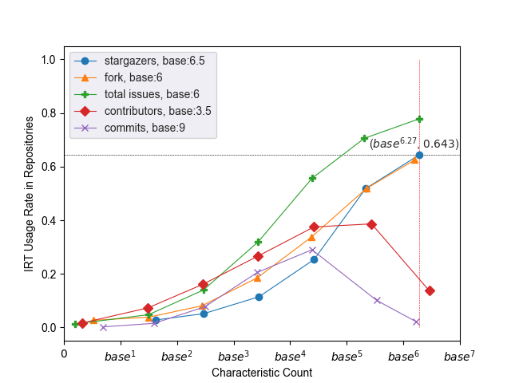
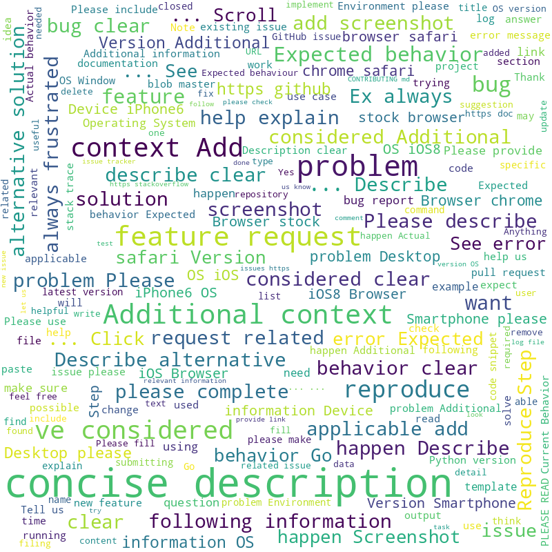

# GIRT-Data (GitHub Issue Report Template Dataset)

GIRT-Data is the first and largest dataset of **issue report templates (IRTs)** in both YAML and Markdown format. This dataset and its corresponding open-source crawler tool are intended to support research in this area and to encourage more developers to use IRTs in their repositories. The stable version of the dataset contains `1_084_300` repositories and `50_032` of them support IRTs.


<p align="center">

</p>
<p align="center">
Right: An IRT used by Pytorch Repository for Bug Report, Left: Different Category of IRTs used by Pytorch Repository.
</p>


## Download Data
Got to [releases](https://github.com/kargaranamir/girt-data/releases) part and download the latest version of data.

GIRT-Data stable version:
```bash
!wget https://github.com/kargaranamir/girt-data/releases/download/msr23-v1.0/characteristics_repo.csv
!wget https://github.com/kargaranamir/girt-data/releases/download/msr23-v1.0/characteristics_irts_markdown.csv
!wget https://github.com/kargaranamir/girt-data/releases/download/msr23-v1.0/characteristics_irts_yaml.csv
```

## Load Data

The data collected for all repositories (Repository characteristics) and IRTs (Characteristics of IRTs in Markdown and YAML) is stored in tabular, column-oriented format. The data can be imported into a pandas dataframe or a SQL schema. The query function and logical conditions can be used to filter information easily.

### Pandas
```Python
import pandas as pd
```

Repository characteristics:
```Python
df_repo = pd.read_csv('characteristics_repo.csv') # primary_key='full_name'
print(df_repo.columns)

> Index(['full_name', 'is_fork', 'has_issues', 'created_at', 'last_modified',
       'pushed_at', 'main_language', 'total_issues_count', 'open_issues_count',
       'closed_issues_count', 'total_pull_requests_count',
       'open_pull_requests_count', 'closed_pull_requests_count', 'size',
       'topics', 'stargazers_count', 'subscribers_count', 'forks_count',
       'commits_count', 'assignees_count', 'branches_count', 'releases_count',
       'is_archive', 'has_wiki', 'contributors_count', 'open_issues_countv2',
       'closed_issues_countv2', 'total_issues_countv2', 'has_IRT'],
      dtype='object')
 ```
 
Characteristics of IRTs in Markdown:
```python
df_irt_markdown = pd.read_csv('characteristics_irts_markdown.csv') # primary_key='IRT_full_name'
print(df_irt_markdown.columns)

> Index(['name', 'about', 'title', 'labels', 'assignees', 'body', 'IRT_name',
       'full_name', 'has_initial_table', 'IRT_raw', 'IRT_full_name',
       'headlines', 'body_anonymized'],
      dtype='object')
```

Characteristics of IRTs in YAML:
```python
df_irt_yaml = pd.read_csv('characteristics_irts_yaml.csv') # primary_key='IRT_full_name'
print(df_irt_yaml.columns)

> Index(['IRT_name', 'full_name', 'IRT_full_name', 'IRT_raw'], dtype='object')
```


## Crawler
To Crawl this data for your target repositories, You need to modify `username` (your GitHub username), `personal_token` (accessible [here](https://github.com/settings/tokens)) and your `target_repos` (`List['repo_user/repo_name']`) in `crawler.py` and then run it:

```python
python3 crawler.py
```

## Statistics

### Programming Languages
In GIRT-Data dataset, we have over 1000 repositories for every 19 major programming languages.
```python
{
   "JavaScript":232_050,
   "Python":214_918,
   "Java":87_498,
   "C++":72_997,
   "PHP":59_869,
   "TypeScript":58_001,
   "C":55_453,
   "Go":53_478,
   "C#":51_648,
   "Shell":43_196,
   "Ruby":39_559,
   "Objective-C":27_634,
   "Rust":23_303,
   "Swift":22_693,
   "Kotlin":14_631,
   "Dart":12_830,
   "Elixir":4_505,
   "Groovy":2_272,
   "HTML":1_598
}
```

### Preliminary Analysis
We have preliminarily analyzed the relationship between some repository characteristics and IRT usage rate. The figure below shows the proportion of repositories that use IRTs for each range of repository characteristics. Since the scale of characteristics differs, different axis bases are used for each characteristic. As can be seen, the chance of IRTs being used in repositories increases as most characteristic counts rise. Contributors and commits, however, do not exactly follow this pattern.

<p align="center">

</p>
<p align="center">
IRT support rates in repositories based on various characteristics. In the case of repositories with a number of stargazers between $6.5^6$ and $6.5^7$ (with average stargazers number of $6.5^{6.27}$), the possibility of supporting an IRT is $0.643$.
</p>

### Worcloud

To illustrate what type of information developers normally ask contributors to include in their issues, we created a word cloud based on the body of IRTs in Markdown format.

Reproducing:
```python
python3 wordcloud_plot.py
```

<p align="center">

</p>
<p align="center">
Wordcloud of IRTs in Markdown format
</p>

## Citation
The dataset is published in [MSR 2023](https://conf.researchr.org/track/msr-2023/msr-2023-data-showcase) conference, under the title of "GIRT-Data: Sampling GitHub Issue Report Templates".

```python
@inproceedings{nikeghbal2023girt,
  title={GIRT-Data: Sampling GitHub Issue Report Templates},
  author={Nikeghbal, Nafiseh and Kargaran, Amir Hossein and Heydarnoori, Abbas and Sch{\"u}tze, Hinrich},
  year={2023},
  booktitle = {2023 IEEE/ACM 20th International Conference on Mining Software Repositories (MSR)},
  pages= {104--108}
}
```
